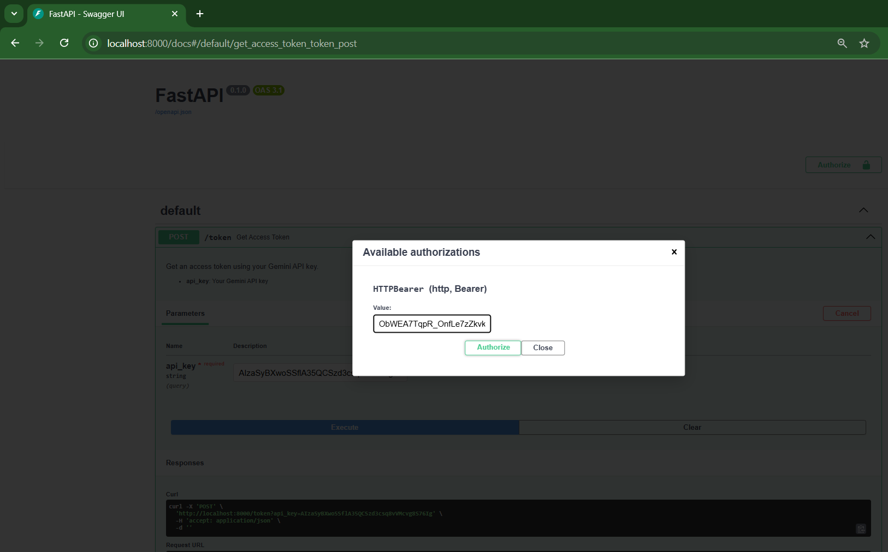

# Demonstration

### NB: All API keys shown below have been deleted & will not work. Create your own api key here: [google ai studio](https://aistudio.google.com/apikey)

## Step 1: Copy your Gemini AI Studio api key

## Step 2: Follow the [README](../README.md) instructions to access the /docs page in the application.

## Step 3: Click on the /token endpoint

## Step 4: Click on Try it out, paste your API key & click on Execute

## Step 5: Highlight & copy the access token (text inside the double quotes, don't copy the double quotes).

## Step 6: Click on the padlock icon at the top right of the page, paste the access token.

## Step 7: Click Authorise.

## Step 8: All protected endpoints will now be executable, click Close.

## Step 9: Protected endpoints now have a black padlock next to them & ready for use.

## Step 10: Click on the /convert/ endpoint, click Try it out & click on Chose File next to Files.

## Step 11: Pick a pdf file to convert.

## Step 12: Enter your custom Prompt instruction or leave empty, then click on Execute
- Choose whether the conversion should happen in the background or not
- Choose whether the resulting html file should be saved to the Gemini File API

## Step 13: A message will be shown, saying that the conversion is being done in the background.

## Step 14: Navigate to the /list_files/ endpoint, click on Try it out & Execute.

## Step 15: A list of converted files should be visible, highlight & copy the uri of the converted HTML file.

## Step 16: Navigate to the /fetch_html/ endpoint, click Try it out & paste the uri.
- Click on Execute.
- A loading icon will appear until the file is loaded.

